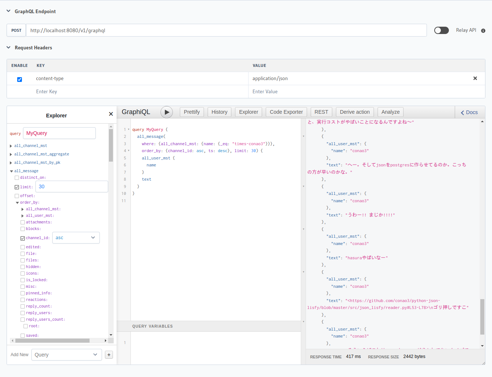

# js-slack-aggregator-viewer



## Usage

### Start server

```bash
docker compose up
```

Then, you can access DB via psql.

```bash
PGPASSWORD='postgrespassword' psql -h localhost -p 15432 -d postgres -U postgres
```

### Prepare data

```bash
ln -s /path/to/slack-aggregator
./bin/slack-aggregator-csv
```

`slack-aggregator-csv` is a python script and I use Python 3.11.2


### Load data

1. execute `sql/001_create_table.sql`
2. execute `sql/010_load_files.sql`

messages are separated multiple files, so you can generate load script.

```bash
ls -1 slack-aggregator-csv/message/* | perl -nle 'print "\\copy all_message from '"'"'" . $_ . "'"'"' csv header;"' > load_message.sql
```
then, load it `\i load_message.sql` (in psql REPL)


### hasura

Open hasura console.

```bash
hasura console
```
