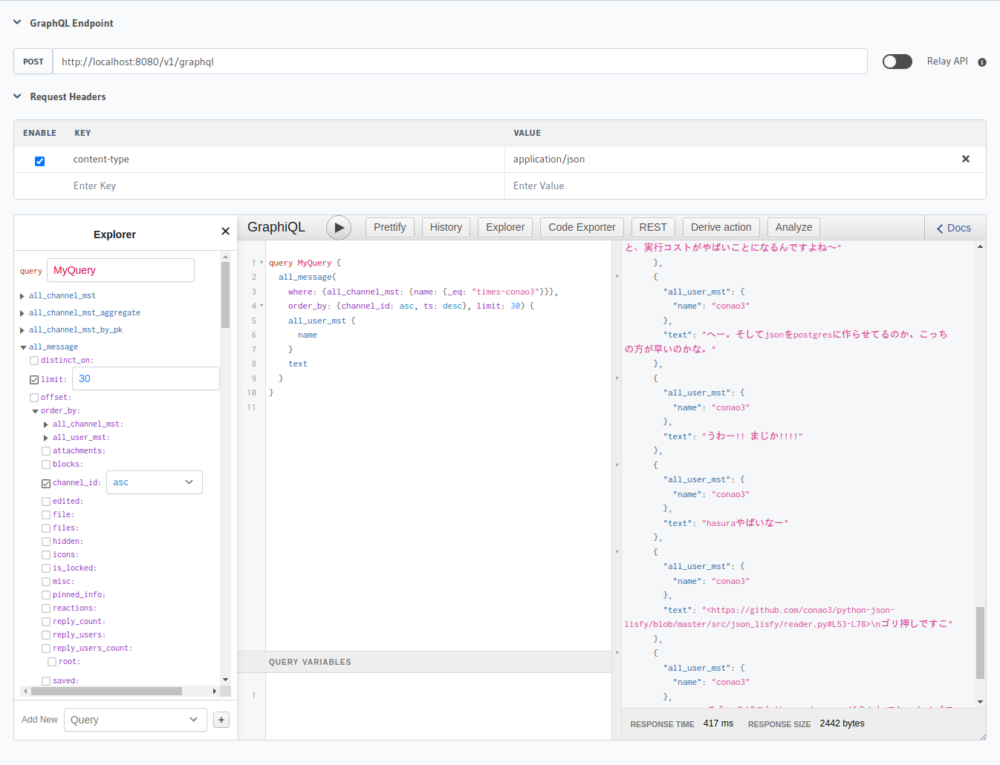

# Hasura Slack Aggregator

A tool for importing Slack workspace export data into PostgreSQL, with a Hasura GraphQL API for flexible querying.



## Overview

This project provides infrastructure to:

- Import Slack export data (users, channels, messages) into a relational database
- Convert Slack JSON exports to CSV format for efficient bulk loading
- Expose the data through Hasura's GraphQL API for flexible querying and exploration

## Prerequisites

- Docker and Docker Compose
- Python 3.11+
- [slack-aggregator](https://github.com/kuuote/slack-aggregator) for collecting Slack data
- Hasura CLI (for console access)

## Quick Start

### 1. Start the Services

```bash
docker compose up -d
```

This starts PostgreSQL (port 15432) and Hasura GraphQL Engine (port 8080).

### 2. Prepare the Data

Link your slack-aggregator output directory and run the CSV converter:

```bash
ln -s /path/to/slack-aggregator slack-aggregator
./bin/slack-aggregator-csv
```

This generates CSV files in `slack-aggregator-csv/`.

### 3. Create Database Tables

Connect to PostgreSQL and execute the table creation script:

```bash
PGPASSWORD='postgrespassword' psql -h localhost -p 15432 -d postgres -U postgres
```

Inside psql:

```sql
\i sql/001_create_table.sql
```

### 4. Load the Data

For master data (users, channels, profiles):

```sql
\i sql/010_load_files.sql
```

For messages (split across multiple files), generate the load script:

```bash
ls -1 slack-aggregator-csv/message/* | perl -nle 'print "\\copy all_message from '"'"'" . $_ . "'"'"' csv header;"' > load_message.sql
```

Then load in psql:

```sql
\i load_message.sql
```

### 5. Access the GraphQL API

Open the Hasura console:

```bash
hasura console
```

Or visit http://localhost:8080 directly.

## Database Schema

| Table | Description |
|-------|-------------|
| `all_user_mst` | Slack user accounts |
| `all_profile_mst` | User profile details |
| `all_channel_mst` | Slack channels and groups |
| `all_message` | Channel messages with metadata |

## Configuration

The default configuration uses the following credentials:

| Service | Port | Credentials |
|---------|------|-------------|
| PostgreSQL | 15432 | postgres / postgrespassword |
| Hasura | 8080 | No admin secret (dev mode) |

For production deployments, update `compose.yml` to set `HASURA_GRAPHQL_ADMIN_SECRET` and change database credentials.

## License

MIT
